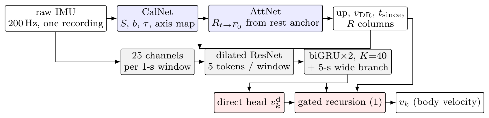

# One unified inertial velocity model for four robots

### IROS 2026 TartanIMU Challenge — **20th of 131 teams**, single author, 13 days

Raw 6-axis IMU in, body-frame velocity out, for a car, a quadruped, a drone and a handheld rig — **one network, one set of weights, no platform label at inference**. Official scoring service over all 89 test sequences: **TartanIMU Score 0.25878** (ATE₂₀ 0.617 m, AVE 0.220 m/s). Kaggle team `Lexxxxx`.

Challenge: [superodometry.com/imuchallenge](https://superodometry.com/imuchallenge/) (CMU AirLab / Super Odometry Group, official benchmark of the IROS 2026 workshop *Beyond Exteroception*) · [Kaggle competition](https://www.kaggle.com/competitions/tartan-imu-challenge-iros2026) · [final standing](https://www.kaggle.com/competitions/tartan-imu-challenge-iros2026/leaderboard?search=Lexxxxx) · [my Kaggle profile](https://www.kaggle.com/lexhoooo/competitions)

<p align="center"></p>

This repository is the complete, curated record of the work: the model and training code, the evaluation rulers I had to build, the cloud automation, the technical report submitted to the organisers, and — the part I think is worth more than the rank — a day-by-day account of what was measured, what was decided on it, and where the outcome differed from what I expected.

| | |
|---|---|
| **Result** | 20 / 131 teams (private leaderboard 0.19912); official full test 0.25878; delivered model `a3v20_s42` |
| **Task** | estimate 3-D body-frame velocity from a 6-axis IMU alone, offline, for four robot types with one shared model |
| **Model** | 2.17 M parameters + 78 k in two frozen sub-modules; dilated 1-D ResNet → biGRU over 40 one-second windows → direct head + learned-gain physics recursion |
| **Scale of work** | ~500 training runs, 33 official scoring queries, 26 Kaggle submissions, ≈ 135 GPU-hours (local + rented 3090 / 5090), 2026-09-08 → 09-21 |
| **My role** | everything: problem analysis, architecture, training, evaluation design, cloud orchestration, delivery package, technical report |
| **Deliverables** | [frozen weights + exact scored predictions](https://huggingface.co/LexHo/tartanimu-a3v20) · [technical report (PDF)](report/technical_report.pdf) · this code |

---

## Results

**[→ Full results, leaderboard context and honest caveats: `docs/results.md`](docs/results.md)**

| Model | Official score ↓ | car ATE | human ATE | dog ATE | drone ATE / AVE | sprint tail Σ AVE |
|---|---|---|---|---|---|---|
| v6: dense-window CNN + biGRU, SSL trunk, time dilation | 0.2702 | 0.337 | 0.603 | 0.357 | 1.274 / 0.723 | 15.1 |
| + S-fast (drag-consistent scaling of the racing family) | 0.2658 | 0.313 | 0.639 | 0.357 | 1.244 / 0.703 | 12.7 |
| **+ learned inertial channels + gated recursion (delivered, `a3v20_s42`)** | **0.2588** | 0.341 | 0.582 | 0.345 | 1.200 / 0.675 | 11.8 |
| variant B: no inertial channels, recording-level FiLM (`a3v21_s42`) | 0.2631 | 0.346 | 0.632 | 0.343 | 1.225 / 0.687 | 12.2 |

Score = 0.6·AVE/0.7356 + 0.4·ATE₂₀/3.1160, macro-averaged over the four platforms; an all-zero submission scores 1.000. Seed range of the delivered recipe 0.2588 / 0.2693 (seeds 42 / 43, seed 42 designated before any seed was scored). All 33 official queries with per-platform and per-sequence breakdown: [`runs/official/`](runs/official/).

The frozen delivery package re-executes on CPU in ~85 s in an isolated environment and reproduces the scored `submission.csv` to 2 × 10⁻³ m/s.

## What is in the model

- **Input** — dense random-offset 1-s windows; 25 channels = raw IMU (6) + decomposition about a slow complementary-filter "up" (8) + rest reference (4) + learned-INS channels (7).
- **Learned-INS channels** from two small sub-modules stored in the same checkpoint and frozen: `CalNet` (64-d recording summary → accelerometer scale / bias / time constant / gyro-axis map) and `AttNet` (rest-anchored SO(3) gyro integration with GRU corrections). From them: a bounded dead-reckoned velocity `q·tanh(∫(R f + g)/q)`, time since the rest anchor, and the rotation to the anchor frame.
- **Trunk / context / heads** — dilated 1-D ResNet (5 tokens per window) → bidirectional GRU over 40 windows + a 5-s low-pass branch → a direct velocity head plus a learned-gain recursion `v_k = ΔR_k v_{k−1} + ΔV_k + K_k (v_direct − v_prop)` over window-to-window IMU increments.
- **Training** — masked-IMU self-supervised pre-training of the trunk (released train+val IMU only), then 120 epochs on train+val, last-epoch weights. Augmentation: physics-consistent time dilation `f' = k²(f − g·û) + g·û`, **S-fast** `f' = s(f − g·û) + g·û, v' = s·v` on the identity-source racing family only, direction-only yaw augmentation.
- **Inference** — deterministic, offline within one trajectory, no platform label, no ensembling, no TTA, no adaptation, no external data.

## What I learned

1. **Every ruler measures a population.** The released validation split is honest for ordinary drone flights and blind to the sprint tail that decides 43 % of the drone error; a high-rotation fold and a sprint fold measure two other populations. A change can win, lose and win on the three at once, and all three are right. I switched from ranking on rulers to gating on them (threshold = 2× the ruler's seed spread) and stopped reading the public leaderboard.
2. **Fold design decides what a channel can learn.** Holding out *all* sprints made a rest-reference channel learn the wrong sign; the same channel was null on a fold that keeps sibling sprints in training.
3. **The models did not read drag.** A counterfactual probe (scale the horizontal specific force of the two sprint sequences by 0.5 / 1.5) moved predictions by < 0.3 m/s. Time dilation *raises* the sprints (drag ∝ k², speed ∝ k); S-fast fixes the ratio at 1 and is the first of ~30 interventions that moved the tail.
4. **Physics inside a regressor helps only where its assumptions hold, and a learned gate cannot recover the assumptions from the signal.** The recursion gain is one knob with one trade-off: gain ≈ 1 reproduces the no-physics model, 3 % propagation gives the delivered gain, 12–40 % gives a uniform in-distribution lag on every platform. 22 ablations in one night, all documented as a negative result.
5. **Sensor conventions vary inside one platform.** 239 of 282 training drone recordings have an IMU frame that is "upside down plus a recording-specific yaw offset" relative to the labels; random body-yaw augmentation destroys the other source. The strongest entries win on the ordinary drone flights with 64-s contexts and a bias/gravity-state smoother — physics in a smoother, not in a forward recursion.

## Documents

| | |
|---|---|
| [`docs/results.md`](docs/results.md) | final standing, leaderboard context, what each step bought, honest caveats, how to verify |
| [`report/technical_report.pdf`](report/technical_report.pdf) | the report submitted to the organisers (IROS workshop template): eight investigations, each as *measured / result / decision / what differed* |
| [`docs/chronicle.md`](docs/chronicle.md) | day-by-day record of all 13 days, architecture evolution, every official query, the negative-results catalogue (~60 entries with the number that killed each), compliance ledger |
| [`docs/workflow_playbook.md`](docs/workflow_playbook.md) | the ten problems that kept recurring, distilled into an eight-layer workflow and a decision tree |
| [`docs/recursion_gain_study.md`](docs/recursion_gain_study.md) | the closing night: 22 cards on the physics-recursion line, and why it is one knob with one trade-off |
| [`docs/peer_survey.md`](docs/peer_survey.md) | what the other public entries did, and the four specific things the leading entry does that I did not |
| [`docs/canonical_numbers.md`](docs/canonical_numbers.md) | one source of truth for every number quoted in the README, the form and the report |
| [`docs/evidence/`](docs/evidence/) | leaderboard exports, submission history, screenshots |

## Repository layout

```
predict.py, requirements.txt    inference entry point (identical to the HF repos)
unified/                        model, data pipeline, augmentation, sub-modules, training scripts
local_eval/                     rulers: official scorer on val, sprint/rotation folds, label-free probes
runs/official/*.csv             every official scoring-service result (overall / platform / per-sequence)
runs/folds/*.json               the stress-fold definitions
cloud/                          GPU-cloud automation: bootstrap, lane runner, self-stop, result collector
report/                         LaTeX source + PDF of the technical report
docs/                           results, chronicle, playbook, studies, evidence
```

## Reproduce a submission

```bash
pip install -r requirements.txt
# download weights/tartanimu_a3v20_s42.pt from the HF repo into weights/
python predict.py --data /path/to/tartan-imu-challenge-iros2026 --out submission.csv
```

Training flags of the delivered model are stored in the checkpoint's `args`; the recipe line is in [`docs/canonical_numbers.md`](docs/canonical_numbers.md). Data are not redistributed (competition licence: academic research only). Cite Tartan IMU (Zhao et al., CVPR 2025) and the [challenge page](https://superodometry.com/imuchallenge/) if you build on this.

## Acknowledgements

CMU AirLab / Super Odometry Group for the dataset, the scoring service and the rule clarifications; GPUtw for cloud GPUs. Code review and analysis were assisted by AI tools; all experiments, numbers and claims were verified by the author.

## Licence

Code and documents: MIT. Weights: see the Hugging Face repositories. Dataset: competition licence, not included.
